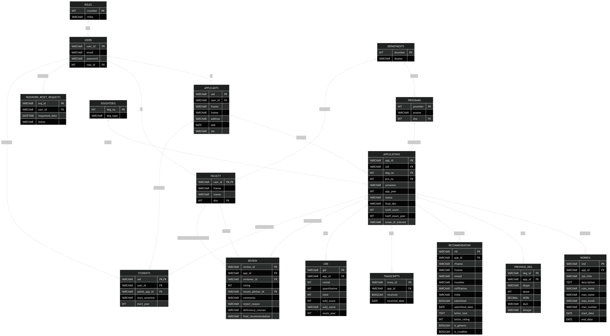

# Phase I Report — APPS (Application Processing System)

---

## Entity-Relationship Diagram

> Please provide an ER diagram for your DB organization.

### Entities and Key Attributes

- **roles** (`rnumber` PK, `rtitle`)
- **users** (`user_id` PK, `email`, `password`, `role_id` FK→roles)
- **departments** (`dnumber` PK, `dname`)
- **programs** (`pnumber` PK, `pname`, `dno` FK→departments)
- **applicants** (`uid` PK, `user_id` FK→users, `fname`, `lname`, `address`, `dob`, `ssn`)
- **faculty** (`user_id` PK FK→users, `fname`, `lname`, `dno` FK→departments)
- **soughtdeg** (`deg_no` PK, `deg_type`)
- **applications** (`app_id` PK, `uid` FK→applicants, `deg_no` FK→soughtdeg, `pro_no` FK→programs, `semester`, `app_year`, `status`, `final_dec`, `toefl_score`, `toefl_exam_year`, `areas_of_interest`)
- **workex** (`wid` PK, `app_id` FK→applications, `job_title`, `description`, `com_name`, `man_name`, `man_email`, `man_number`, `start_date`, `end_date`)
- **previous_deg** (`deg_id` PK, `app_id` FK→applications, `dtype`, `dyear`, `dGPA`, `duni`, `dmajor`)
- **recommendation** (`rid` PK, `app_id` FK→applications, `rfname`, `rlname`, `remail`, `rnumber`, `raffiliation`, `rtitle`, `submitted`, `submitted_date`, `letter_text`, `letter_rating`, `is_generic`, `is_credible`)
- **transcripts** (`trans_id` PK, `app_id` FK→applications, `received`, `received_date`)
- **gre** (`gid` PK, `app_id` FK→applications, `verbal`, `quantitative`, `total`, `subj_score`, `subj_name`, `exam_year`)
- **review** (`review_id` PK, `app_id` FK→applications, `reviewer_id` FK→faculty, `rating`, `recom_advisor_id` FK→faculty, `comments`, `reject_reason`, `deficiency_courses`, `final_recommendation`)
- **students** (`uid` PK FK→applicants, `user_id` FK→users, `admit_app_id` FK→applications, `start_semester`, `start_year`)
- **password_reset_requests** (`req_id` PK, `user_id` FK→users, `requested_date`, `status`)

### Key Relationships

- A **role** can be assigned to many **users**, but each **user** has exactly one **role**.
- A **user** may represent an **applicant**, **student**, **faculty reviewer**, **GS**, **CAC**, or **admin**, depending on `role_id`.
- A **department** can offer many **programs**, and each **program** belongs to exactly one **department**.
- A **department** can also have many **faculty** members.
- An **applicant** is associated one-to-one with a **user** account.
- An **applicant** may submit one or more **applications** over time.
- Each **application** is associated with exactly one **sought degree** and exactly one **program**.
- Each **application** may have:
  - zero or more **work experience** entries,
  - zero or more **previous degree** records,
  - zero or more **recommendation** letters,
  - zero or more **transcript** records,
  - zero or more **GRE** records,
  - and zero or more **faculty reviews**.
- Each **review** is written by one **faculty** reviewer for one **application**.
- Each **review** may optionally recommend one **faculty advisor**.
- When admitted, an **applicant** may become a **student**, linked to the application that resulted in admission.
- A **user** may submit multiple **password reset requests** over time.

---

## DB Organization

> Please provide documentation for your chosen database schema, including a discussion of the normalization levels.

### Schema Overview

The database is implemented using **SQLite** for development and testing, with a schema that is compatible with migration to **MySQL** for production deployment. The system is designed to support the full graduate admissions workflow, including user authentication, application submission, supporting documents, faculty review, admission decisions, and student promotion.

The schema is centered around the **applications** table, which acts as the core record tying together applicants, degree objectives, academic programs, recommendations, transcripts, reviews, and final decisions.

## Table Descriptions

### **roles**
Stores the set of valid system roles. These roles define authorization levels throughout the application. Current values include:

- Applicant (`0`)
- Student (`1`)
- Faculty Reviewer (`2`)
- GS (`3`)
- CAC (`4`)
- Admin (`5`)

This table supports role-based access control and prevents role names from being duplicated across user records.

### **users**
Stores authentication and account information for all system users regardless of role. Each user has a unique `user_id`, unique email address, password, and assigned role.

This table is the central authentication table and is referenced by applicant, faculty, student, and password reset records.

### **departments**
Stores academic departments such as Computer Science, Electrical & Computer Engineering, Biomedical Engineering, Civil & Environmental Engineering, and Mechanical & Aerospace Engineering.

This table is referenced by both **programs** and **faculty**.

### **programs**
Stores academic programs offered by departments, such as MS Computer Science or PhD Biomedical Engineering. Each program belongs to exactly one department through the `dno` foreign key.

This design avoids duplication of department information inside application records.

### **applicants**
Stores personal and identifying information for graduate applicants. Each applicant is linked one-to-one with a `users` record through `user_id`.

Fields include name, address, date of birth, and SSN. The `uid` serves as the applicant’s institutional identifier and is used throughout the application process.

### **faculty**
Stores faculty and reviewer profile information. Each faculty record is tied to a `users` record and linked to a department using `dno`.

This table is used for both application reviewers and recommended faculty advisors.

### **soughtdeg**
A lookup table containing valid degree types, such as **MS** and **PhD**.

This table ensures degree types are standardized and not duplicated across application rows.

### **applications**
This is the central entity of the system. Each row represents a single graduate application submitted by an applicant for a specific program and degree type.

It stores:
- the semester and year of intended admission,
- current application status,
- final admission decision,
- TOEFL information (if applicable),
- and areas of academic interest.

The `status` field is constrained to:
- `Incomplete`
- `Complete`
- `Under Review`
- `Decision Made`

The `final_dec` field is constrained to:
- `Admit`
- `Admit with Aid`
- `Reject`
- `Waitlist`

This table serves as the parent table for most admissions-related records.

### **workex**
Stores prior work experience associated with an application. This is a one-to-many child table of **applications**.

Each record contains:
- job title,
- company name,
- job description,
- manager contact information,
- and employment dates.

This structure allows each applicant to submit multiple work experiences without violating normalization.

### **previous_deg**
Stores prior academic degrees associated with an application. This is also a one-to-many child table of **applications**.

Each row records:
- degree type,
- graduation year,
- GPA,
- university,
- and major.

A GPA validation constraint ensures `dGPA` remains between `0.00` and `4.00`.

### **recommendation**
Stores recommender information and submitted recommendation letter details for an application.

Each record includes:
- recommender name and email,
- affiliation and title,
- whether the recommendation was submitted,
- submission date,
- letter text,
- optional rating,
- and evaluation metadata such as whether the letter appears generic or credible.

This table supports multiple recommendation letters per application.

### **transcripts**
Stores transcript receipt status for an application.

Each transcript record indicates:
- whether the transcript has been received,
- and the date it was received.

This supports tracking of required academic documentation during admissions processing.

### **gre**
Stores GRE exam results for an application.

Fields include:
- verbal score,
- quantitative score,
- total score,
- subject score,
- subject exam name,
- and exam year.

This table supports both general GRE and subject GRE reporting.

### **review**
Stores faculty evaluations of submitted applications.

Each review contains:
- the faculty reviewer,
- optional recommended advisor,
- rating,
- comments,
- reject reason,
- deficiency course notes,
- and final recommendation.

This table allows multiple faculty reviews to be recorded for the same application and supports later CAC/GS decision-making.

### **students**
Stores admitted applicants who have transitioned into enrolled students.

Each student record links:
- the applicant (`uid`),
- the corresponding system user (`user_id`),
- and the application through which admission occurred (`admit_app_id`).

This supports tracking students after an admission decision has been made.

### **password_reset_requests**
Stores user password reset requests.

Each request includes:
- the requesting user,
- the date of the request,
- and the request status (default: `Pending`).

This allows the system to track password reset workflow separately from authentication data.

## Normalization Discussion

### **First Normal Form (1NF)**
The schema satisfies **1NF** because all tables contain atomic values and there are no repeating groups within any single row.

Examples:
- Prior degrees are stored in **previous_deg** rather than as repeated columns in **applications**
- Work experience entries are stored in **workex**
- Recommendation letters are stored in **recommendation**

This ensures that all repeating or multi-valued attributes are represented as separate related records.

### **Second Normal Form (2NF)**
The schema satisfies **2NF** because all non-key attributes depend on the entire primary key of their respective tables.

Most tables use a **single-column primary key** (such as `app_id`, `deg_id`, `wid`, `rid`, etc.), so partial dependency issues do not arise.

For example:
- In **previous_deg**, all attributes depend on `deg_id`
- In **workex**, all attributes depend on `wid`
- In **review**, all attributes depend on `review_id`

### **Third Normal Form (3NF)**
The schema is designed to satisfy **3NF** by removing transitive dependencies and isolating lookup/reference data into separate tables.

Examples:
- Degree types are stored in **soughtdeg** instead of being repeated in **applications**
- Program information is stored in **programs**
- Department information is stored in **departments**
- User roles are stored in **roles**

This prevents duplication and improves consistency across the database.

One small exception is the `total` column in **gre**, which is derivable from `verbal + quantitative`. This is a deliberate design choice for convenience and reporting efficiency, though it introduces a controlled redundancy.

### **Boyce-Codd Normal Form (BCNF)**
Most tables also satisfy **BCNF**, since every determinant in the schema is a candidate key.

For example:
- In **users**, `user_id` determines all other attributes
- In **programs**, `pnumber` determines `pname` and `dno`
- In **applications**, `app_id` determines all application-specific attributes

The schema therefore largely meets BCNF requirements, with only minor practical denormalization (such as `gre.total`) retained for convenience.

### **Overall Design**
Overall, the database is designed to meet **Third Normal Form (3NF)** while maintaining flexibility for future reporting and workflow features. The schema supports the full admissions lifecycle and is structured to simplify future query development for application review, faculty recommendations, admission outcomes, and applicant tracking.

---

## Testing

> Please detail and document how you test the system. Separately document any unit tests and manual tests.

## Unit Tests

Unit tests are used to validate the correctness of helper functions, data workflows, and authorization rules.

### **Schema / Constraint Validation**
The database schema is tested by recreating all tables in a clean SQLite environment and confirming that:
- all foreign key relationships are valid,
- all required fields are enforced,
- and all `CHECK` constraints behave correctly.

The following cases are verified:

- inserting an application with an invalid `status` should fail,
- inserting an application with an invalid `final_dec` should fail,
- inserting a previous degree with `dGPA` outside `0.00–4.00` should fail,
- inserting a recommendation with `letter_rating` outside `1–5` should fail,
- inserting a child record (such as `applications`, `review`, or `students`) without its parent should fail due to foreign key enforcement.

### **Password Hashing / Authentication**
Authentication logic is tested to ensure user credentials are handled securely.

Verified cases include:
- password hashes are generated correctly,
- a valid plaintext password matches its stored hash,
- an incorrect password does not authenticate,
- duplicate emails are rejected,
- and duplicate `user_id` values are rejected.

### **Application Status Logic**
Application completeness and state transitions are tested through helper logic and route behavior.

Verified cases include:
- an application remains **Incomplete** if required materials are missing,
- an application becomes **Complete** once all required materials are submitted,
- an application can transition to **Under Review** after faculty evaluation begins,
- and an application can transition to **Decision Made** only after a final decision is recorded.

### **Role-Based Access Control**
Authorization decorators and route protections are tested to confirm users only access permitted features.

Examples include:
- applicants cannot access faculty review pages,
- faculty cannot access admin-only functions,
- CAC/GS dashboards are restricted to the appropriate roles,
- and unauthenticated users are redirected to the login page when attempting protected actions.

### **ID / Record Creation**
Tests are also performed to confirm that newly created records are generated and linked correctly.

Examples include:
- creating a new applicant correctly inserts rows into **users** and **applicants**,
- creating an application correctly links to the intended applicant, program, and degree,
- and admitting an applicant correctly creates a **students** record tied to the original application.

## Manual Tests

Manual testing is performed by running the application locally and validating the end-to-end workflow through the user interface.

### **Account Creation and Login**
1. Navigate to the signup page and create a new applicant account.
2. Confirm that a new row is inserted into **users** with role `Applicant`.
3. Log out and log back in to verify session and authentication behavior.
4. Attempt login with an incorrect password and confirm access is denied.
5. Attempt registration with a duplicate email or username and verify that the system rejects it.

### **Applicant Profile and Application Submission**
1. Log in as an applicant and open the application form.
2. Enter personal information, academic details, and program selection.
3. Add one or more previous degrees.
4. Add recommendation request information.
5. Add work experience and GRE/TOEFL data if applicable.
6. Submit the application and verify rows are created in:
   - **applicants**
   - **applications**
   - **previous_deg**
   - **recommendation**
   - **workex**
   - **gre** (if entered)
   - **transcripts**

7. Verify that invalid or incomplete required fields are rejected.

### **Recommendation Submission**
1. Simulate a recommender opening the recommendation submission link.
2. Submit a recommendation letter.
3. Verify:
   - `submitted = TRUE`
   - `submitted_date` is populated
   - `letter_text` is saved
   - optional evaluation metadata is stored if used

4. Attempt to re-submit the same recommendation and verify duplicate submission behavior is handled correctly.

### **Transcript Processing**
1. Log in as GS or authorized staff.
2. Locate applications with pending transcripts.
3. Mark a transcript as received.
4. Verify:
   - `received = TRUE`
   - `received_date` is populated
   - the application status updates appropriately if all required materials are complete

### **Faculty Review Workflow**
1. Log in as a faculty reviewer.
2. Open a complete application assigned for review.
3. Submit a review containing:
   - rating,
   - comments,
   - recommended advisor,
   - reject reason (if applicable),
   - deficiency courses,
   - and final recommendation.

4. Verify that a new row is created in **review**.
5. Confirm the application status updates as expected for the review stage.

### **Final Decision Workflow (CAC / GS)**
1. Log in as CAC or GS.
2. View applications that have completed review.
3. Submit a final decision such as:
   - `Admit`
   - `Admit with Aid`
   - `Reject`
   - `Waitlist`

4. Verify:
   - `applications.final_dec` is updated,
   - `applications.status` becomes `Decision Made`,
   - and if admitted, a **students** record is created.

5. Confirm that rejected or waitlisted applicants do not receive a **students** record unless later admitted.

### **Applicant Status Tracking**
1. Log in as the applicant and open the application status page.
2. Verify the displayed status matches the current database state:
   - Incomplete application
   - Complete application
   - Under Review
   - Decision Made
3. Confirm that final decision messages are displayed correctly for admit, admit with aid, reject, or waitlist outcomes.

### **Password Reset Workflow**
1. Submit a password reset request as a user.
2. Verify that a row is created in **password_reset_requests**.
3. Log in as admin and view pending requests.
4. Process the reset and confirm the user can log in with the new password.
5. Confirm request status updates appropriately after completion.