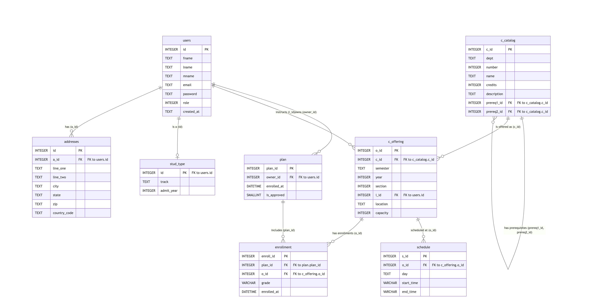

# Phase I Report

## Entity-Relation Diagram

> Please provide an ER diagram for your DB organization.

## DB Organization

> Please provide documentation for your chosen data-base schema, including a discussion of the normalization levels.

The database is built on a highly relational schema designed to separate user identity, academic records, and course scheduling. The core tables include:

* **Users & Roles:** The `users` table handles authentication and core identity, using an integer `role` flag (0=Admin, 1=Secretary, 2=Faculty, 3=Student) for access control. Specific student details are abstracted into a `stud_type` sub-table, and locations into an `addresses` table.
* **Course Catalog & Offerings:** `c_catalog` acts as the master directory of all available courses and their prerequisites. `c_offering` represents a specific instance of a course occurring in a specific semester/year, assigned to an instructor (linking back to `users`).
* **Scheduling:** The `schedule` table handles the time blocks for course offerings. By keeping this separate, a single offering can easily have multiple meeting times (e.g., a Monday/Wednesday class) without schema changes.
* **Enrollment & Academic Plans:** The `plan` table acts as a container for a student's academic journey. The `enrollment` table functions as a junction table between a student's `plan` and a specific `c_offering`, tracking the state of their grade.

**Normalization Levels:**
The database schema generally adheres strictly to **Third Normal Form (3NF)** to ensure data integrity and eliminate redundancy:
* **First Normal Form (1NF):** All tables have a primary key, and all attributes contain atomic values. We do not use repeating groups (for example, course schedules are broken out into multiple rows in the `schedule` table rather than using comma-separated strings or `day1`, `day2` columns in the offerings table).
* **Second Normal Form (2NF):** Every non-key attribute is fully dependent on the primary key. Most tables utilize single-column, auto-incrementing surrogate keys (like `c_id`, `o_id`, `s_id`) to cleanly guarantee this.
* **Third Normal Form (3NF):** There are no transitive dependencies. For instance, instructor names and emails are strictly kept in the `users` table rather than being duplicated in the `c_offering` table; course names and credit counts are kept in `c_catalog` and referenced by `c_offering` rather than being copied over. 

## Testing

> Please detail and document how you test the system. Separately document any unit tests, and manual tests.

Our testing strategy is divided into two parts: automated unit testing for foundational security/logic, and manual end-to-end testing for complex user workflows. 

### Automated Unit Tests
We use `pytest` alongside `pytest-mock` to test the basic functionalities of the application. By mocking the `pymysql` database connection, we ensure that our automated tests run quickly and never risk altering the live AWS RDS production database. Our unit tests cover:
* **Auth:** Verifying that login, registration, and session management logic execute correctly under both successful and failed conditions.
* **Utils:** Testing isolated mathematical and logic functions, specifically the `to_minutes` converter and the `has_time_conflict` schedule verification logic to guarantee a 30-minute gap is strictly enforced between classes.
* **Roles & Security:** Testing the `@role_required` decorators to ensure that unauthenticated users are redirected to login, and authenticated users are strictly blocked from accessing blueprints assigned to other roles (e.g., a Student attempting to access a System Admin portal).

### Manual Tests
Because the system relies heavily on stateful, role-dependent workflows, the remainder of the application's features are tested by hand. We execute a "Day in the Life" manual testing strategy where we assume the four different user roles to verify the UI and database interactions:
* **Student:** Registering for courses to verify that prerequisite blocks, time conflict blocks, and duplicate enrollment blocks trigger correctly. Dropping courses and viewing dynamic transcripts.
* **Faculty:** Viewing assigned course rosters and successfully submitting grades without overwriting finalized records.
* **Grad Secretary:** Utilizing administrative override powers to edit grades and viewing global schedules.
* **System Admin:** Testing CRUD operations on the user base, assigning/unassigning faculty to courses, and verifying that the global logger correctly captures all system events.